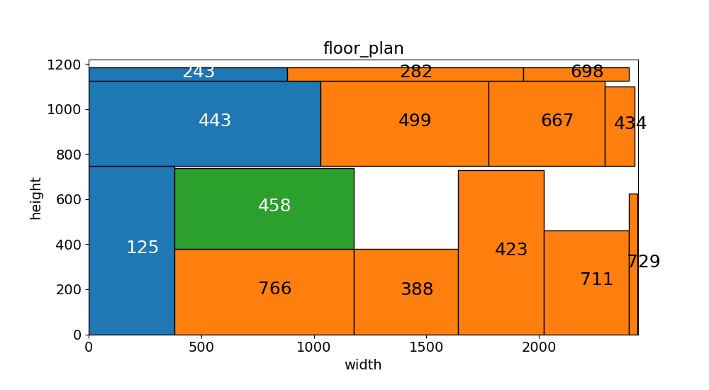
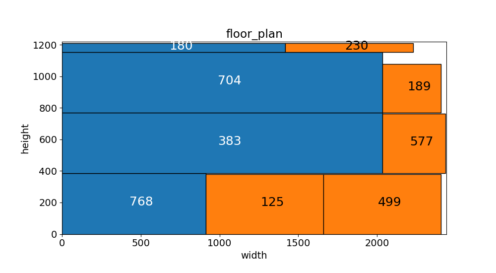

### 2022届华为杯数学建模B题（改进）
在前人的基础上，添加一个旋转约束，有细微提升

原链接：https://github.com/MinhZou/GMCM-2022-B

总结：该方法仅采用贪心算法初始化，并未采用优化算法优化，因此还存在优化空间（如：订单的顺序）
### Methods

Q1：3H切割方式或者3E切割方式 + Item按面积、长边或者短边排序 + 填充按面积、长边或者短边排序。 

Q2：Item总数量和总面积约束的DBSCAN算法进行组批，组批完采用Q1的方法进行排样。

### Usage

Just run the main.py to obtain the results, or modify the config settings in main.py and run.

```
python main.py
```

### Results

#### Question 1:

表 1 A组数据排样结果表

|  数据  | 消耗板材数 | 板材利用率 | 消耗板材数(improved) | 板材利用率(improved) |
| :----: | :--------: | :--------: | :--------: | :--------: |
| dataA1 |     88     |   0.949    |   87        |    0.959      |
| dataA2 |     86     |   0.963    |   86        |    0.963      |
| dataA3 |     87     |   0.962    |   87        |    0.962      |
| dataA4 |     86     |   0.952    |   85        |    0.962      |


#### Question 2:

表 2 组批及排样结果表

|  数据  | 批次数 | 消耗板材数 | 板材利用率 |  消耗板材数(improved) | 板材利用率(improved) |
| :----: | :----: | :--------: | :--------: | :--------: | :--------: |   
| dataB1 |   57   |    3777    |   0.788    |  3734        |   0.797        |
| dataB2 |   44   |    2506    |   0.769    |  2477        |   0.777        |
| dataB3 |   49   |    2502    |   0.772    |  2479        |   0.779       |
| dataB4 |   43   |    2549    |   0.796    |  2540        |   0.799       |
| dataB5 |   74   |    4030    |   0.767    |  4004        |   0.771       |


### Visualization

Examples of visualization results.

原图像

改进后


在原图像中，订单“125”被初始化，但其宽>长，使得右侧的切割具有不确定性(损失较多)，
因此在切割第一刀时，判断订单的长宽关系，给予旋转约束，使得右侧的高更小。